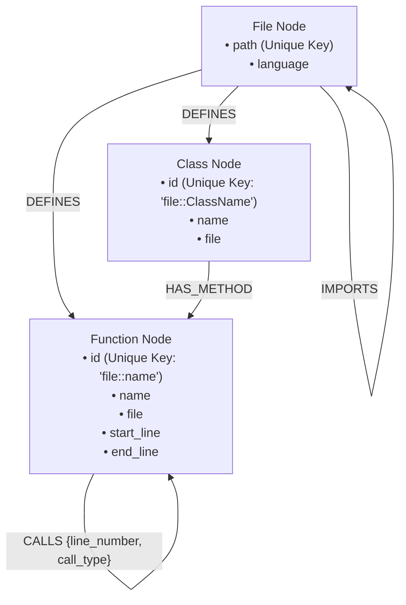

# Neo4j Graph Schema Specification

This document defines the schema of the Neo4j dependency call-graph for **ImpactGraph**.

## Schema Diagram



---

## Node Labels and Properties

### 1. `File`
Represents a source file in the repository.

*   **Label**: `:File`
*   **Unique Constraint**: `path`
*   **Properties**:
    *   `path` *(String)*: Relative filepath in the repository. (Unique Identifier)
    *   `language` *(String)*: Source code language (e.g. `python`, `typescript`).

### 2. `Function`
Represents a function or method definition.

*   **Label**: `:Function`
*   **Unique Constraint**: `id`
*   **Properties**:
    *   `id` *(String)*: Unique identifier formatted as `<file_path>::<function_name>`. (e.g., `auth.py::authenticate_user`).
    *   `name` *(String)*: Local function name (e.g. `authenticate_user`).
    *   `file` *(String)*: File path containing the function.
    *   `start_line` *(Integer)*: Starting line number of the definition.
    *   `end_line` *(Integer)*: Ending line number of the definition.

### 3. `Class`
Represents a class structure.

*   **Label**: `:Class`
*   **Unique Constraint**: `id`
*   **Properties**:
    *   `id` *(String)*: Unique identifier formatted as `<file_path>::<class_name>`. (e.g., `auth.py::UserManager`).
    *   `name` *(String)*: Class name (e.g. `UserManager`).
    *   `file` *(String)*: File path containing the class.

---

## Relationship Types

### 1. `(File)-[:DEFINES]->(Function)`
Indicates that a specific file contains the declaration of the target function.

### 2. `(File)-[:DEFINES]->(Class)`
Indicates that a specific file contains the declaration of the target class.

### 3. `(Class)-[:HAS_METHOD]->(Function)`
Indicates that a function is a method defined inside a specific class.

### 4. `(File)-[:IMPORTS]->(File)`
Represents file-level import statements.

### 5. `(Function)-[:CALLS {line_number, call_type}]->(Function)`
Represents execution-flow dependency where one function calls another.

*   **Relationship Properties**:
    *   `line_number` *(Integer)*: The line number in the source file where the call occurs.
    *   `call_type` *(String)*: Type of invocation. Must be one of:
        *   `direct`: Direct function invocation within the same file or imported scope.
        *   `method`: Call to an object method.
        *   `library`: Call to an external library function.
        *   `recursive`: Recursive self-invocation.
        *   `async`: Asynchronous function execution or dispatch.

---

## Uniqueness Constraints

Uniqueness constraints are created automatically during the first ingestion or via Cypher console. See `graph/constraints.cypher`:

```cypher
CREATE CONSTRAINT file_path_unique IF NOT EXISTS FOR (f:File) REQUIRE f.path IS UNIQUE;
CREATE CONSTRAINT function_id_unique IF NOT EXISTS FOR (fn:Function) REQUIRE fn.id IS UNIQUE;
CREATE CONSTRAINT class_id_unique IF NOT EXISTS FOR (c:Class) REQUIRE c.id IS UNIQUE;
```

---

## Design Decisions

1.  **Unique Identifiers**: Standard local names (like `parse`) collision across files is solved by using `<file_path>::<name>` format as the unique identifier.
2.  **Missing Calls Graceful Insertion**: If a call target is not present in the extraction list (e.g., call to standard libraries or unparsed functions), the ingestor still creates a `Function` node with the `id` key. This prevents missing edge errors.
3.  **Multiple Identical Calls**: In Cypher, `MERGE (caller)-[r:CALLS {line_number: ...}]->(callee)` merges uniquely on line number. If a function calls the same function multiple times on different lines, distinct edges are recorded.
